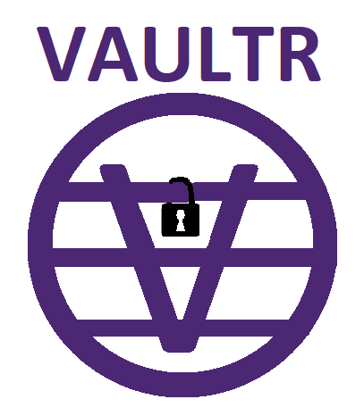

# VAULTR : A flutter based app for storing your highly secured datas.

## Features:

Phase 1: Referrence Memo

* Flutter app with fingerprint authentication
* Provision to save highly personal data like credit card details, Password, etc.
* User can store based on key and version of data also available
* So that user can search and get the data from VAULTR
* Should be able to add images
* Should be able to set reminders
* Export and import backups
* Double locking with pattern or pin locks